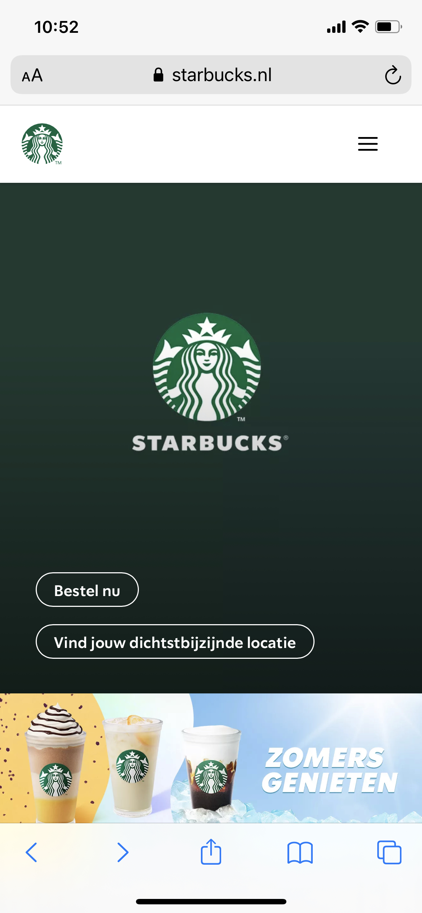

# Procesverslag
Markdown is een simpele manier om HTML te schrijven.  
Markdown cheat cheet: [Hulp bij het schrijven van Markdown](https://github.com/adam-p/markdown-here/wiki/Markdown-Cheatsheet).

Nb. De standaardstructuur en de spartaanse opmaak van de README.md zijn helemaal prima. Het gaat om de inhoud van je procesverslag. Besteedt de tijd voor pracht en praal aan je website.

Nb. Door *open* toe te voegen aan een *details* element kun je deze standaard open zetten. Fijn om dat steeds voor de relevante stuk(ken) te doen.

## Jij

  
uitwerken voor kick-off werkgroep

  ### Auteur:
  Joni Hahn

  #### Je startniveau:
  Een mix van rood een blauw.
  Rood voor HTML en CSS
  Blauw voor Javascript

  #### Je focus:
  Nog even naar kijken
 

## Je website

  
uitwerken voor kick-off werkgroep

  ### Je opdracht:
  https://www.starbucksathome.com/nl/?gclid=EAIaIQobChMIqPnCtaL9-QIVV6HVCh3RNg7UEAAYASAAEgJCtvD_BwE
  Wel op telefonische formaat

  #### Screenshot(s) van de eerste pagina (small screen): 
  Home  
  

  #### Screenshot(s) van de tweede pagina (small screen):
  Our Coffees
  
 

## Toegankelijkheidstest 1/2 (week 1)

  
uitwerken na test in 1e werkgroep

  ### Bevindingen
  Lijst met je bevindingen die in de test naar voren kwamen:

  #### Screenreader
   Wanneer de spreker kwam zij die dat het voor de screenreader gebruikt wordt het handig is als headers eerst komen dan een plaatje, zodat een blind persoon weet waarbij een plaatje hoort.
   Terugdekkend op de test kwam dat op mijn website ook naar voren.

   Dit ga ik oplossen door headers boven plaatjes of bepaalde secties te plaatsen.

  #### Muis en Toetsenbord 
  Door de tap te gebruiken kun je door alle links en buttons doorheen.
  Als je door de hamburger menu heen tapt dan ga je uiteindelijk verder naar de website en dus niet terug naar het kruisje om het menu weg te halen.

  Hier een omschrijving van hoe het opgelost kan worden (met indien nodig afbeeldingen)

  #### Motoriek (shocks, elastiekjes)
  Met het schokapparaat ging alles goed ik denk dat er makkelijk op de knoppen te drukken is.
 

  #### Visueel (brillen, contrast, kleurenblind, dark/light). 
  De Starbucks website heeft geen Dark mode.

  Om de dark mode op te lossen wil ik mijn eigen dark mode voor de website verzinnen. Ik denk namelijk dat nog best mogellijk is ,omdat 
  de meeste starbucks kleuren groen zijn en deze kleuren passen ook als je bijvoorbeeld een zwarte achtergrond hebt.

## Breakdownschets (week 1)

  
uitwerken na afloop 2e werkgroep

  ### de hele pagina: 
  

  ### dynamisch deel (bijv menu): 
  

  ### wellicht nog een dynamisch deel (bijv filter): 
  

## Voortgang 1 (week 2)

  
uitwerken voor 1e voortgang

  ### Stand van zaken
  Ik wil van de eerste pagina met grid werken om de content zonder dat ze vast op de background image staan.

  ### Agenda voor meeting
  samen met je groepje opstellen

  | student 1    
  | student 2
  | student 3

  ### Verslag van meeting
  hier na afloop snel de uitkomsten van de meeting vastleggen

  - Aria labels gebruiken voor links met plaatjes.
  - Heb de grid besproken bet mijn groepje en begrijp al wat meer van.
  - nog een punt
  - ...

## Voortgang 2 (week 3)

  
uitwerken voor 2e voortgang

  ### Stand van zaken
  Het grid voor de pagina blijft een beetje moeillijk om te begripen en heb ik weer lopen kloten omdat het niet hellemaal stond hoe ik het wilde.
  Daarnaast heb ik aan de hamburger menu gezet met een kleine verandering nu er alleen maar voor zorgen dat er ook iets uitklapt.

  ### Agenda voor meeting
  samen met je groepje opstellen

  | Joni           | Rosalie            | Sjoerd       | Aset             |
  | ---            | ---                | ---          | ---              |
  | CSS            | en dit             | en ik dit    | en dan ik dat    |
  | en dat ook nog | dit als er tijd is | nog een punt | dit wil ik zeker |
  | ...            | ...                | ...          | ...              |

  ### Verslag van meeting
  hier na afloop snel de uitkomsten van de meeting vastleggen

  - punt 1
  - punt 2
  - nog een punt
- ...

## Toegankelijkheidstest 2/2 (week 4)

  
uitwerken na test in 8e werkgroep

  ### Bevindingen
  Lijst met je bevindingen die in de test naar voren kwamen (geef ook aan wat er verbeterd is):

  #### Screenreader
  Hier korte omschrijving (met indien nodig afbeeldingen)

  Hier een omschrijving van hoe het opgelost kan worden (met indien nodig afbeeldingen)

  #### Muis en Toetsenbord 
  Net als de originele website kun je door alles links en buttons door heen tappen.
  Er zit een soort van volgorde in als je er doorheen tapt alleen net als de originele website ga je niet terug  

  Hier een omschrijving van hoe het opgelost kan worden (met indien nodig afbeeldingen)

  #### Motoriek (shocks, elastiekjes)
  Omdat de styling bijna het zelfde is als je de originele pagina kun je er nu ook weer makkelijk door heen.
  Ik denk achteraf gezien is het voormijn website handiger om meer naar kleuren en sceenreader te kijken.

  Hier een omschrijving van hoe het opgelost kan worden (met indien nodig afbeeldingen)

  #### Visueel (brillen, contrast, kleurenblind, dark/light). 
  Door de bleur is sommige tekst moeillijk om te lezen. Nog steeds geen Dark Mode

  Hier een omschrijving van hoe het opgelost kan worden (met indien nodig afbeeldingen)

## Voortgang 3 (week 4)

  
uitwerken voor 3e voortgang

  ### Stand van zaken
  De laatste paar stappen gaan super goed.
  Het is vooral nog een kwestie van de kleine styling en ervoor zorgen dat de CSS er tip top uitziet.

  ### Agenda voor meeting
  samen met je groepje opstellen

  | Rosalie        | Joni               | Sjoerd       | Aset             |
  | ---            | ---                | ---          | ---              |
  | Darkmode       | Summary details    |              | is ziek komt     |
  |                | stylen.            |              | niet             |
  | ...            | Hamburgermenu focus|              | ...              |
                     

  ### Verslag van meeting
  hier na afloop snel de uitkomsten van de meeting vastleggen

  - punt 1
  - punt 2
  - nog een punt
  - ...

## Eindgesprek (week 5)

  
uitwerken voor eindgesprek

  ### Je uitkomst - karakteristiek screenshots:
  

  ### Dit ging goed/Heb ik geleerd: 
  Korte omschrijving met plaatjes

  

  ### Dit was lastig/Is niet gelukt:
  Korte omschrijving met plaatjes

  

## Bronnenlijst

  
continu bijhouden terwijl je werkt

  Nb. Wees specifiek ('css-tricks' als bron is bijv. niet specifiek genoeg).

  1. bron 1
  2. bron 2
  3. ...

