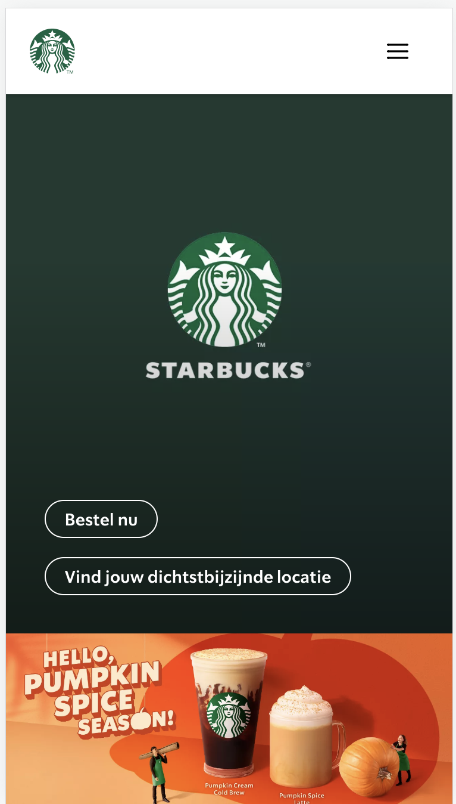
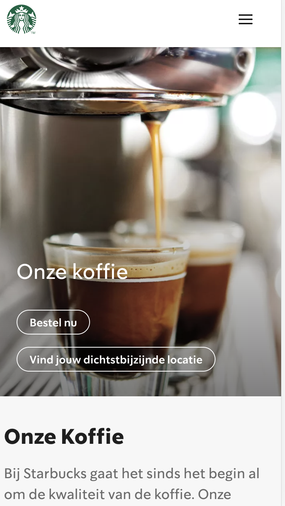
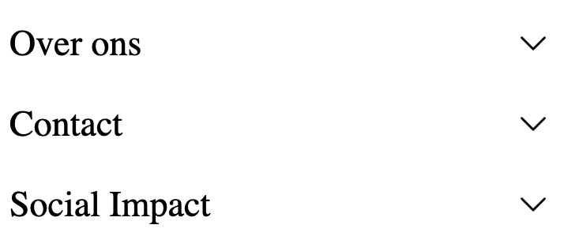
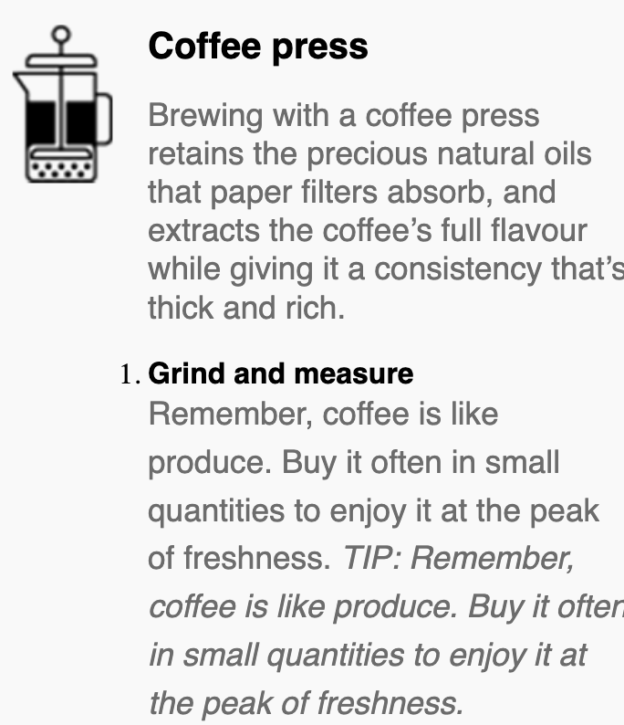

# Procesverslag
Markdown is een simpele manier om HTML te schrijven.  
Markdown cheat cheet: [Hulp bij het schrijven van Markdown](https://github.com/adam-p/markdown-here/wiki/Markdown-Cheatsheet).

Nb. De standaardstructuur en de spartaanse opmaak van de README.md zijn helemaal prima. Het gaat om de inhoud van je procesverslag. Besteedt de tijd voor pracht en praal aan je website.

Nb. Door *open* toe te voegen aan een *details* element kun je deze standaard open zetten. Fijn om dat steeds voor de relevante stuk(ken) te doen.

## Jij

  
uitwerken voor kick-off werkgroep

  ### Auteur:
  Joni Hahn

  #### Je startniveau:
  Een mix van rood een blauw.
  Rood voor HTML en CSS
  Blauw voor Javascript

  #### Je focus:
  Ik mijn focus vooral gelegd op service plane, maar ik ga er ook voor zorgen dat de website op meerdere telefoons bekekek kan worden.
  
 

## Je website

  
uitwerken voor kick-off werkgroep

  ### Je opdracht:
  https://www.starbucksathome.com/nl/?gclid=EAIaIQobChMIqPnCtaL9-QIVV6HVCh3RNg7UEAAYASAAEgJCtvD_BwE
  Wel op telefonische formaat

  #### Screenshot(s) van de eerste pagina (small screen): 
  Home  
  

  #### Screenshot(s) van de tweede pagina (small screen):
  Our Coffees
  
 

## Toegankelijkheidstest 1/2 (week 1)

  
uitwerken na test in 1e werkgroep

  ### Bevindingen
  Lijst met je bevindingen die in de test naar voren kwamen:

  #### Screenreader
   -

  #### Muis en Toetsenbord 
  Door de tap te gebruiken kun je door alle links en buttons doorheen.
  Als je door de hamburger menu heen tapt dan ga je uiteindelijk verder naar de website en dus niet terug naar het kruisje om het menu weg te halen.

  #### Motoriek (shocks, elastiekjes)
  Met het schokapparaat ging alles goed ik denk dat er makkelijk op de knoppen te drukken is.
 

  #### Visueel (brillen, contrast, kleurenblind, dark/light). 
  De Starbucks website heeft geen Dark mode.

  Om de dark mode op te lossen wil ik mijn eigen dark mode voor de website verzinnen. Ik denk namelijk dat nog best mogellijk is ,omdat 
  de meeste starbucks kleuren groen zijn en deze kleuren passen ook als je bijvoorbeeld een zwarte achtergrond hebt.

## Breakdownschets (week 1)

  
uitwerken na afloop 2e werkgroep

  ### de hele pagina: 
  
  eerlijk gezegd had ik ze niet toen we deze opdrachten moesten maken was ik al druk bezig met mijn pagina.
  wegens tijdsnood heb ik er dan ook niet veel meer aangedaan.

 

## Voortgang 1 (week 2)

  
uitwerken voor 1e voortgang

  ### Stand van zaken
  Ik wil van de eerste pagina met grid werken om de content zonder dat ze vast op de background image staan.

  ### Agenda voor meeting
  samen met je groepje opstellen

  | Joni - grid    
  | rosalie - background filmpje en img
  | Aset
  | Rosalie

  ### Verslag van meeting
  hier na afloop snel de uitkomsten van de meeting vastleggen

  - Aria labels gebruiken voor links met plaatjes.
  - Heb de grid besproken bet mijn groepje en begrijp al wat meer van.
  - nog een punt
  - ...

## Voortgang 2 (week 3)

  
uitwerken voor 2e voortgang

  ### Stand van zaken
  Het grid voor de pagina blijft een beetje moeillijk om te begripen en heb ik weer lopen kloten omdat het niet hellemaal stond hoe ik het wilde.
  Daarnaast heb ik aan de hamburger menu gezet met een kleine verandering nu er alleen maar voor zorgen dat er ook iets uitklapt.

  ### Agenda voor meeting
  samen met je groepje opstellen

  joni - css bespreken
  Rosalie - achtergrond, uitklappen menu
  Sjoerd - annimatie, positioneren, alt labels, media queries
  Aset - annimatie, hamburger menu

  ### Verslag van meeting
  hier na afloop snel de uitkomsten van de meeting vastleggen

  - Ik moet alles om een section heen zetten en daar de padding op zetten.
  - punt 2
  - nog een punt
- ...

## Toegankelijkheidstest 2/2 (week 4)

  
uitwerken na test in 8e werkgroep

  ### Bevindingen
  Lijst met je bevindingen die in de test naar voren kwamen (geef ook aan wat er verbeterd is):

  #### Screenreader
  De screenreader ging goed we gingen overal door heen en de aria-labels werkten ook.

  #### Muis en Toetsenbord 
  Net als de originele website kun je door alles links en buttons door heen tappen.
  Er zit een soort van volgorde in als je er doorheen tapt alleen net als de originele website ga je niet terug  

  #### Motoriek (shocks, elastiekjes)
  Omdat de styling bijna het zelfde is als je de originele pagina kun je er nu ook weer makkelijk door heen.
  Ik denk achteraf gezien is het voormijn website handiger om meer naar kleuren en sceenreader te kijken.

  

  #### Visueel (brillen, contrast, kleurenblind, dark/light). 
  Door de bleur is sommige tekst moeillijk om te lezen. Nog steeds geen Dark Mode
  De letters waren te klein.

  Door een dark/ light mode te maken en de tekst wat groter maken.

## Voortgang 3 (week 4)

  
uitwerken voor 3e voortgang

  ### Stand van zaken
  De laatste paar stappen gaan super goed.
  Het is vooral nog een kwestie van de kleine styling en ervoor zorgen dat de CSS er tip top uitziet.

  ### Agenda voor meeting
  samen met je groepje opstellen

  | Rosalie        | Joni               | Sjoerd       | Aset             |
  | ---            | ---                | ---          | ---              |
  | Darkmode       | Summary details    | Annimatie    | is ziek komt     |
  |                | stylen.            |              | niet             |
  | ...            | Hamburgermenu focus|              | ...              |
  | ...            | Divs               |              | ...              |
  | ...            | Toegankelijkheid   |              | ...              |
              

  ### Verslag van meeting
  hier na afloop snel de uitkomsten van de meeting vastleggen

  - nog wat beter kijken naar transform
  - Javascript nog even gied bekijken
  - 
  - ...

## Eindgesprek (week 5)

  
uitwerken voor eindgesprek

  ### Je uitkomst - karakteristiek screenshots:
  

  ### Dit ging goed/Heb ik geleerd: 
  Ik heb tijdens dit vak best wel wat geleerd zou heb ik wel iets meer verstand gekregen van javascript maar blijf het moeillijk vinden.
  Daarnaast weet ik nu ook dropdown te maken wat veel makkelijker is dan ik dacht op het eerste moment.

  
  
  Het gebruiken van posistion en transform had ik hiervoot ook nog niet gebruikt dus dat was ook heel intresant om meer over te weten.
  

  ### Dit was lastig/Is niet gelukt:
  Ik blijf het hele concept van java script gewoon moeillijk blijven.
  hierdoor zijn dingen die ik wilde doen zoals het halloween thema veranderen kleuren. Ik heb en dan ook voor gekozem om de dark en light mode samen te voegen dan krijg je ook wat halloween kleuren.

## Herkansing

Wat heb ik veranderd

Ik heb er nu viir gezorgd dat het de font wordt meegenomen en dat het nu niet uitmaakt of de de font al automatisch hebt opgeslagen in je laptop/computer. 
Ik heb nog wel even naar de link gekeken die u mij had doorgestuurd en met dat krijg ik steeds in error te zien. 
Daardoor heb ik gekozen om een @import te gebruiken van google fonts.
En ik hebe ervoor gezorgd dat je op allebei de pagina's de teskte groter en kleiner maken. Wat op een of andere manier best een strugle was.

## Bronnenlijst

  
continu bijhouden terwijl je werkt

  1. https://www.youtube.com/watch?v=ydeQbbF9jbw
  2. https://codepen.io/shooft/pen/jOzvRvm hulp voor de hamburger menu
  3. https://www.youtube.com/watch?v=HZHHBwzmJLk voor de annimatie
  4. https://codepen.io/shooft/pen/dymRMBZ voor de hamburger button zelf

